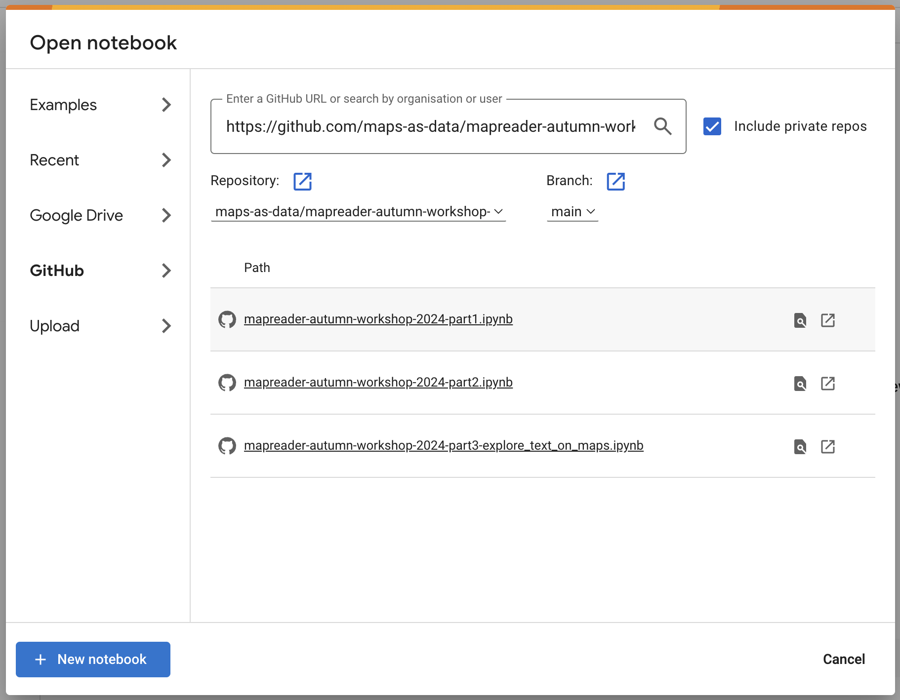

# MapReader Autumn Workshop 2024

This repo contains worked examples of running [MapReader](https://github.com/maps-as-data/MapReader), designed for the Data/Culture Autumn Workshop 2024.

There are three notebooks in this repository:

1. `mapreader-autumn-workshop-2024-part1.ipynb`: A quick run-through of MapReader's classification pipeline.
2. `mapreader-autumn-workshop-2024-part2.ipynb`: A worked example of MapReader's text spotting pipeline.
3. `mapreader-autumn-workshop-2024-part3-explore_text_on_maps.ipynb`: Some examples of how to work with the MapReader classification and text spotting outputs.

Follow the instructions below to set up the notebook in Docker or on Google Colab.

<h2>Table of contents</h2>

- [Set up - Docker](#set-up---docker)
  - [Creating the Docker image](#creating-the-docker-image)
  - [Running the Docker container](#running-the-docker-container)
- [Set up - Google Colab (short version)](#set-up---google-colab-short-version)
- [Detailed instructions for setting up on Google Colab](#detailed-instructions-for-setting-up-on-google-colab)
  - [Optional: Change the runtime type](#optional-change-the-runtime-type)

## Set up - Docker

### Creating the Docker image

Clone the repository and navigate to the root directory of the repository.

```bash
git clone https://github.com/maps-as-data/mapreader-autumn-workshop-2024
cd mapreader-autumn-workshop-2024
```

To create the Docker image, run the following command:

```bash
docker build -t mapreader-workshop .
```

### Running the Docker container

To run the Docker container, run the following command:

```bash
mkdir workshop_outputs
docker run -p 8888:8888 --mount type=bind,source=$PWD/workshop_outputs,target=/app/workshop_outputs mapreader-workshop
```

Click the link that appears in the terminal to open the notebook in your browser.

## Set up - Google Colab (short version)

If you are familiar with Google Colab, you can set up the notebook by following these steps. If you are new to Google Colab, please refer to the [detailed instructions](#detailed-instructions-for-setting-up-on-google-colab) below.

- Open [Google Colab](https://colab.research.google.com/)
- In the "Open notebook" window, click the "GitHub" option
- Paste the URL of this repository into the search bar and press Enter
- Open one of the notebooks (e.g. `mapreader-autumn-workshop-2024-part1.ipynb`)

## Detailed instructions for setting up on Google Colab

1. In your browser, navigate to [Google Colab](https://colab.research.google.com/).

   An "Open notebook" window should appear automatically. If it doesn't, click `File` > `Open notebook...`.

   

2. In the "Open notebook" window, click the "GitHub" option:

   

3. Paste the URL of this repository into the search bar and press `Enter`.

    

4. After pressing `Enter`, a list of notebooks in the repository should appear. Click on one of the notebooks (e.g. `mapreader-autumn-workshop-2024-part1.ipynb`) to open it.

    

5. The notebook should now be opened and look like this:

    

6. You can now run the notebook by clicking the play button on the left of each cell.

    The first cells of the notebook will set up everything you need to run on Google Colab. 

    - _Note that Google may display a warning that the notebook is not authored by Google. You can ignore this warning._

    

    - A pop up will ask if you want to connect to Google Drive. If you are happy with this, click `Connect to Google Drive`:

    

    - You will be asked to sign in:
    
    

    - And then to allow Google Colab to access your Google Drive. You should click `Continue`:

    

7. You should then be able to run all the cells in the notebook. A green tick to the left of the cell indicates that the cell has run successfully.

    _Note that the second cell will install all requirements for the notebook to run. It will take some time, and will display some warnings. Those can be ignored. At the bottom, you will see a message that the installation was successful._

    

### Optional: Change the runtime type

By default, Google Colab uses a CPU runtime. If you want to use a GPU runtime, you can change this by clicking `Runtime` > `Change runtime type` and selecting `GPU` from the `Hardware accelerator` dropdown.

1. Click `Runtime` > `Change runtime type`.

    

2. In the "Change runtime type" window, select `GPU` from the `Hardware accelerator` dropdown. Click `Save` to apply the changes.

    

    After you save the changes, the runtime will be changed to GPU and the core needs to be restarted. Click `OK` to restart the runtime.

    

3. The runtime type should now be changed to GPU.

    